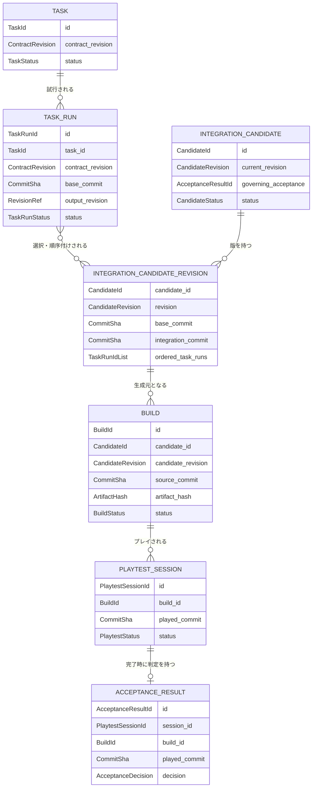

# 中核ドメインモデル

> Status: Draft / MVPで実装する規則の基準  
> Scope: `Task`、`Task Run`、`Integration Candidate`、`Build`、`Acceptance Result`の関係と不変条件

## 1. この文書の目的

本書は、制作意図から`main`へマージされた成果へ至る中核モデルを定義する。画面構成や外部APIではなく、次の問いに対する業務上の答えを固定する。

- Taskと一回の実行結果をどう区別するか。
- 複数のTask Runを何単位で統合・検証するか。
- どのcommitから、どのTask Runを含むBuildが作られたかをどう証明するか。
- 人間の受け入れ判断が、どのBuildとcommitに対するものかをどう固定するか。
- commitや構成が変わったとき、何を再実行しなければならないか。
- どの条件を満たしたときだけ`main`へマージし、Taskを受け入れ済みにできるか。

本書の「なければならない」「してはならない」は実装が守る規範である。既存文書と解釈が分かれる場合、中核5概念の関係と不変条件については本書を優先し、要件そのものは[`MVP.md`](MVP.md)を正とする。

## 2. 一文で表す中核モデル

> Taskは「何を実現するか」、Task RunはそのTaskを実行した「一回の試行」、Integration Candidateは選択したTask Run群を統合した「`main`への提案」、Buildはその提案の一意のcommitから生成した「プレイ可能な成果物」、Acceptance ResultはそのBuildを人間がプレイして下した「変更不能な判定事実」である。

`SUCCEEDED`、`TECHNICALLY_VERIFIED`、`READY`、`ACCEPTED`は同義ではない。

```text
Task Run SUCCEEDED
  = 一回のTask実行がローカル品質ゲートを通過した

Integration Candidate TECHNICALLY_VERIFIED
  = 統合commitがリモートCIと独立AIレビューを通過した

Build READY
  = そのcommitからプレイ可能なartifactを生成・識別できた

Acceptance Result decision ACCEPTED
  = 人間がそのBuildをプレイして受け入れた

Task ACCEPTED
  = 受け入れ対象と同じCandidate revisionがmainへマージされた
```

## 3. 関係図



補助概念である`Integration Candidate Revision`と`Playtest Session`を図に含めている。前者はCandidate変更時の証拠失効を曖昧にしないため、後者は「プレイ中」と「記録済みの判定」を混同しないために必要である。

### 多重度と所有関係

| 関係 | 多重度 | 規則 |
| --- | --- | --- |
| Task → Task Run | 1対0..N | 再実行、修正、別案は常に新しいTask Runにする。 |
| Candidate Revision ↔ Task Run | 多対多 | 一つのrevisionは複数Runを統合でき、一つのRunは別Candidateや別revisionでも評価できる。 |
| Candidate Revision → Build | 1対0..N | platform違い、再Build、artifact違いは別Buildにする。 |
| Build → Playtest Session | 1対0..N | 同じBuildを複数回、別scenarioや別人がプレイできる。 |
| Playtest Session → Acceptance Result | 1対0..1 | 進行中Sessionには結果がなく、完了したSessionには一つだけ結果がある。 |

BuildからAcceptance Resultへの関係は直接の1対1ではない。必ずPlaytest Sessionを介するため、一つのBuildに複数のAcceptance Resultが存在し得る。ただし、一回のSessionに記録できる結果は一つだけである。

## 4. 各概念の責務

### 4.1 Task

Taskは、実現したい論理的な作業と、その実行契約を表す。実行process、branch、commit、Buildは所有しない。

最低限、次を持つ。

- 安定した`TaskId`
- 目的と非目標
- 関連するAcceptance Criterion
- 型付き依存関係
- 現在有効なTask Contract revision
- `allowed_paths`、`forbidden_paths`、必須検証、リスク
- Task自身のライフサイクル状態

Taskの`ACCEPTED`は人間が直接setする状態ではない。対象Task Runを含むCandidate revisionが受け入れられ、そのrevisionが`main`へ正常にマージされた事実から成立する。

### 4.2 Task Run

Task Runは、一つのTask Contract revisionを一つのbase commit上で実行した、一回限りの試行である。

作成時に次を固定し、後から別の値へ差し替えてはならない。

- `TaskRunId`
- `TaskId`
- `TaskContractRevision`
- `base_commit`
- 実行種別と再試行元Runへの参照

実行中にworktree、branch、Codex thread、TDD証拠、local check、scope checkを関連付ける。完了時には、統合対象となる`head_commit`またはcontent-addressedな`output_revision`を固定する。

Task Runの成功は、Taskの受け入れを意味しない。また、失敗したTask Runを成功へ書き換えず、修正は新しいTask Runとして記録する。

### 4.3 Integration Candidate

Integration Candidateは、選択したTask Runの成果を依存順に統合し、`main`へ提案する単位である。draft PR、技術検証、Build、受け入れ、mergeの追跡単位になる。

Candidateは安定した`CandidateId`を持つ。一方、含有Run、統合順序、base commit、integration commitのいずれかが変わるたびに`CandidateRevision`を増やす。

```text
CandidateRef = CandidateId + CandidateRevision + IntegrationCommit
```

Candidate revisionは最低限、次を固定する。

- 統合元となる`base_commit`
- 順序付きの`included_task_runs`
- 各Runから取り込んだ`output_revision`
- 競合解消等を行った`IntegrationRun`の参照
- 統合結果である一意の`integration_commit`
- 対応するPRとPR headの観測値

Candidate IDだけをEvidence、Build、Acceptanceの対象としてはならない。必ずrevisionとcommitまで固定する。

Candidate Aggregateは、現在revisionのmerge判断に採用している`governing_acceptance_result_id`を0または1個持つ。新しいrevisionを作成した時点では必ず空に戻す。

### 4.4 Build

Buildは、一つのCandidate revisionの一意のcommitから生成されたartifactと、その来歴を表す。

最低限、次を持つ。

- `BuildId`
- 生成元の`CandidateId`と`CandidateRevision`
- `source_commit`
- 生成時点のTask Run集合とTask集合のsnapshot
- platformとbuild設定
- artifact URI、artifact hash、生成結果
- Buildライフサイクル状態

同じcommitから再度buildした場合も、同一Buildを上書きせず新しいBuild IDを発行する。Buildが`READY`になった後、その生成元、commit、artifact hash、含有Run集合を変更してはならない。

### 4.5 Acceptance Result

Acceptance Resultは、Playtest Sessionを完了した人間が下した判定事実である。MVPではSession全体に対する判定を一つ記録し、scenarioごとの気づきは`Observation`として保持する。

受け入れ可否と、プレイ中に見つけた事項の種類を混同してはならない。

```text
AcceptanceDecision = ACCEPTED | CHANGES_REQUIRED
ObservationKind = DEFECT | ENHANCEMENT | MANUAL_TUNING | OTHER
```

- `ACCEPTED`: 現在の成果を`main`へ進めてよい。改善用の後続Taskを同時に作成してもよい。
- `CHANGES_REQUIRED`: 現在の成果は受け入れず、同じCandidateを改訂して再検証する必要がある。
- `DEFECT`、`ENHANCEMENT`、`MANUAL_TUNING`は判定値ではなく、判定理由となるObservationの種別である。

これにより、「改善点はあるが今回は受け入れ、改善は新規Taskにする」と「改善してから受け入れる」を区別できる。

Acceptance Resultは最低限、次へ固定する。

- `AcceptanceResultId`
- `PlaytestSessionId`
- `BuildId`
- 実際にプレイした`played_commit`
- `AcceptanceDecision`、理由、操作者、記録時刻
- Observationと、必要なら後続Taskへの参照

Acceptance Resultは状態機械の途中状態ではなく、作成された時点で変更不能な事実である。`PENDING`と`PLAYTESTING`はPlaytest Sessionの状態とする。誤記訂正や判断のやり直しで既存Resultを上書きせず、訂正事実または新しいSessionとResultを追加する。

一つのBuildに複数のResultがある場合でも、Candidate revisionのmerge判断に採用できる`governing_acceptance_result_id`は高々一つとする。現在revisionに対する`CHANGES_REQUIRED`が記録されたら既存の採用を解除し、Candidateを`REVISING`へ戻す。その後に再び受け入れるには、新しい正式なSessionで`ACCEPTED`を記録する。

### 4.6 Aggregateと整合性境界

| Aggregate | 境界内で原子的に守るもの |
| --- | --- |
| `Task` | 現在のContract revision、Task状態、局所的な依存定義 |
| `TaskRun` | 一回の実行状態、固定したContract/base、出力revision、Health/Flag |
| `IntegrationCandidate` | revision列、各revisionのRun構成・統合順・commit、採用中のAcceptance Result |
| `Build` | 生成元CandidateRef、source commit、artifact来歴、Build状態 |
| `PlaytestSession` | 対象Build/commit、Session状態、一つのAcceptance Result |

Task Runの成功からCandidate作成、Candidateの受け入れからmerge、merge成功からTask受け入れのようなAggregate横断処理は、単一Aggregateの更新に見せない。Application層のProcess Managerが各Aggregateのversionを確認し、順序付きCommandとEventで調停する。

## 5. モデル上の明確化事項

既存資料で実装解釈が分かれ得る点を、MVPでは次のように固定する。

1. Candidateの構成またはcommit変更は、同じsnapshotの更新ではなく新しい`CandidateRevision`である。
2. 一つのCandidate revisionが採用できる有効なTask Runは、一つのTaskにつき高々一つである。再実行Runを採用するときは旧Runをそのrevisionの構成から置き換える。
3. Acceptance ResultはMVPではPlaytest Session単位の総合判定とする。scenario単位にはObservationを記録する。
4. 受け入れ可否を表す`AcceptanceDecision`と、発見事項を表す`ObservationKind`を分ける。
5. Acceptance Resultの判定と「現在のCandidateへ適用可能か」は別である。過去の`ACCEPTED`を削除・改変せず、commit不一致なら適用不能と判定する。
6. Candidateの競合解消や手動調整による差分も匿名の変更にしない。新しいTask RunまたはIntegration Runに帰属させる。

これらを変更する場合は、既存データの意味と失効規則に影響するためADRを必要とする。

## 6. 状態機械

各概念は独立した状態機械を持つ。全概念で共有する巨大な`Status` enumは作らない。

### Task

```text
DRAFT → READY → ACTIVE → ACCEPTED
READY → WAITING_DEPENDENCY → READY
DRAFT / READY / WAITING_DEPENDENCY / ACTIVE → CANCELLED
```

- `READY`: 有効なContractがあり、DAG検証済みである。
- `WAITING_DEPENDENCY`: Task自体は実行候補だが`blocks_start`依存が未充足である。
- `ACTIVE`: 少なくとも一つのTask Runまたは統合・受け入れ処理が進行中である。
- `ACCEPTED`: 対象成果が人間に受け入れられ、対応Candidate revisionのmergeが成功した。

### Task Run

```text
QUEUED → PREPARING → AGENT_RUNNING → LOCAL_CHECKING → SUCCEEDED
   │          │             │               └──────→ FAILED
   │          │             ├→ INPUT_REQUIRED ─────→ AGENT_RUNNING
   │          │             └→ DECISION_REQUIRED ──→ AGENT_RUNNING
   └──────────┴────────────────────────────────────→ CANCELLED
```

`STALE`、`SCOPE_VIOLATION`、`CONFLICT_RISK`、`TDD_SEQUENCE_VIOLATION`は主状態と直交するHealth/Flagとする。たとえば、local check自体が成功しても`SCOPE_VIOLATION`があれば統合可能ではない。

### Integration Candidate

```text
DRAFT → COMPOSING → LOCAL_CHECKING → PR_OPEN
  → CI_RUNNING → AI_REVIEWING → TECHNICALLY_VERIFIED
  → BUILDING → PLAYTEST_REQUIRED → ACCEPTED → MERGING → MERGED

COMPOSING / LOCAL_CHECKING / CI_RUNNING / AI_REVIEWING / BUILDING
  └→ FAILED → REVISING → COMPOSING

PLAYTEST_REQUIRED
  ├→ decision: CHANGES_REQUIRED → REVISING
  └→ decision: ACCEPTED → ACCEPTED
                         └→ 必要ならObservationから後続Task作成

commitまたは構成変更
  → 新revisionを作成 → STALE / REVISING → COMPOSING
```

`ACCEPTED`は「現在のrevisionと同じcommitを対象に、decisionが`ACCEPTED`であるResultをmerge判断に採用している」ことを表す。Candidateの`ACCEPTED`とTaskの`ACCEPTED`を混同してはならない。Taskが`ACCEPTED`になるのはmerge成功後である。

### Build

```text
REQUESTED → BUILDING → READY
                 └──→ FAILED

READY → SUPERSEDED
```

`SUPERSEDED`はartifactの存在や過去のプレイ事実を消さない。現在のCandidate revisionを受け入れる根拠として使用できないことを表す。

### Playtest SessionとAcceptance Result

```text
Playtest Session: PENDING → PLAYTESTING → COMPLETED
                       └───────────────→ ABORTED

COMPLETED
  └→ exactly one Acceptance Result
       decision: { ACCEPTED | CHANGES_REQUIRED }
       observations: { DEFECT | ENHANCEMENT | MANUAL_TUNING | OTHER }*
```

Acceptance Result自体には`PENDING`状態を持たせない。

## 7. 不変条件

### 7.1 識別と履歴

- すべてのEntityは種類ごとに型の異なる安定したIDを持たなければならない。
- 別種のID、commit SHA、artifact hashを裸の文字列として相互代入できるモデルにしてはならない。
- Task Runの再試行、Verificationの再試行、Buildの再生成、Playtestのやり直しは既存記録を上書きせず、新しいIDで記録しなければならない。
- 重要な履歴を物理削除してはならない。取消、失敗、失効、置換を状態または追記イベントで表現する。

### 7.2 Taskと依存関係

- `READY`になるTaskはschema検証済みの有効なTask Contract revisionを持たなければならない。
- Task依存グラフには、存在しない参照、自己依存、循環があってはならない。
- `blocks_start`依存先のTaskが`ACCEPTED`になるまで、依存元TaskのRunを開始してはならない。
- `blocks_integration`依存は、依存先がCandidateのbase commit以前に`main`へ取り込まれているか、同じCandidate revision内で依存元より先に統合されなければならない。
- 依存先のContractや公開API変更により前提が変わったRunは`STALE`となり、再評価なしに統合してはならない。

### 7.3 Task Run

- 一つのTask Runは、ちょうど一つのTask、Contract revision、base commitに属さなければならない。
- 作成後にTask、Contract revision、base commitを差し替えてはならない。変更が必要なら新しいRunを作成する。
- 実行枠とworktree leaseを持たないRunを`AGENT_RUNNING`にしてはならない。
- `SUCCEEDED`になるには、必須local check、scope check、最終test suiteをすべて通過しなければならない。
- 振る舞いを変更するRunは、production変更前のRed証拠と変更後のGreen証拠を持たなければならない。
- test削除、skip、assertion弱体化だけでGreenを成立させてはならない。
- 実パスへ解決した全差分は`allowed_paths`内かつ`forbidden_paths`外でなければならない。
- `STALE`、`SCOPE_VIOLATION`、`TDD_SEQUENCE_VIOLATION`を持つRunをCandidateへ採用してはならない。

### 7.4 Integration Candidate

- Candidate revisionは一つ以上の採用Task Runと、一意のintegration commitを持たなければならない。
- 採用するTask Runは`SUCCEEDED`で、統合を阻止するHealth/Flagや未解決の競合を持ってはならない。
- 同じCandidate revisionに、同じTaskのRunを複数採用してはならない。
- 統合順序は`blocks_integration`、共有契約、構造競合の順序制約を満たさなければならない。
- Candidate commitの全差分は、採用Task Runまたは記録されたIntegration Runへ追跡可能でなければならない。
- `UNKNOWN`な競合解析結果を`SAFE`として扱ってはならない。解決、直列化、再解析または人間判断が必要である。
- 技術検証済みになるには、required CIと独立AI Reviewがすべて現在のrevisionのintegration commitを対象として合格していなければならない。
- Candidateの構成、順序、base commit、integration commitの変更はrevisionを増加させなければならない。
- 新しいCandidate revisionは`governing_acceptance_result_id`を引き継いではならない。

### 7.5 Build

- Buildはちょうど一つのCandidate revisionを生成元に持たなければならない。
- Buildの`source_commit`は、そのCandidate revisionの`integration_commit`と一致しなければならない。
- Buildへ記録するTask Run集合は、生成元Candidate revisionのTask Run集合と一致しなければならない。
- Build要求時点で、生成元Candidate revisionは同一commitについて技術検証済みでなければならない。
- `READY`になるにはartifact URIとartifact hashがあり、実際のbuild入力commitが`source_commit`と一致していなければならない。
- 生成中にCandidateのcurrent revisionが変わっても過去のBuild記録を偽装してはならない。完成したBuildは履歴として残し、現在版に対しては`SUPERSEDED`とする。

### 7.6 Acceptance Result

- Playtest Sessionは、開始時に一つの`READY`なBuildへ固定しなければならない。
- Sessionが記録する`played_commit`はBuildの`source_commit`と一致しなければならない。
- Acceptance Resultはちょうど一つのSessionに属し、その`BuildId`とcommitはSessionおよびBuildの値と一致しなければならない。
- 同じSessionへ複数のAcceptance Resultを記録してはならない。
- decision、理由、操作者、記録時刻を欠くAcceptance Resultを作成してはならない。
- decisionが`ACCEPTED`でないResultをmerge許可として扱ってはならない。
- Candidate revisionがmerge判断に採用できるResultは高々一つで、そのResult IDを明示しなければならない。
- 現在revisionに対する`CHANGES_REQUIRED`の記録後は、以前の`ACCEPTED` Resultをmerge根拠として保持してはならない。
- 過去のAcceptance ResultはCandidate変更後も履歴として残すが、新revisionへ流用してはならない。

### 7.7 commit整合性とmerge gate

`main`へマージできるのは、merge直前に次のすべてが同時に成立する場合だけである。

```text
candidate.current_revision == accepted_build.candidate_revision
candidate.integration_commit == accepted_build.source_commit
accepted_build.source_commit == acceptance_result.played_commit
candidate.integration_commit == pull_request.head_commit
required_ci.commit == candidate.integration_commit
ai_review.commit == candidate.integration_commit
acceptance_result.decision == ACCEPTED
candidate.governing_acceptance_result_id == acceptance_result.id
build.status == READY
candidate.status == ACCEPTED
no_blocking_health_flags
main_base_is_compatible
```

- 一項目でも不一致、不明、未完了ならmergeを拒否しなければならない。
- `UNKNOWN`や外部状態の取得失敗を成功として補完してはならない。
- `main`の進行によりrebaseまたはbranch更新が必要なら、新しいCandidate revisionを作成し、CI、AI Review、Build生成、Playtest、Acceptanceを再実行しなければならない。
- merge操作の成功を観測する前にTaskを`ACCEPTED`へしてはならない。
- merge方式により`main`上のmerge commitがCandidateのhead commitと異なる場合、受け入れ対象のsource commitと実際のmerge commitを別フィールドで記録しなければならない。

## 8. 証拠の有効性と失効

証拠は「Candidateに属する」のではなく、原則として`CandidateId + CandidateRevision + CommitSha`へ属する。

```text
EvidenceKey {
  candidate_id,
  candidate_revision,
  subject_commit,
  evidence_kind,
  attempt_id
}
```

現在版に対する有効性は状態として手入力せず、次のように導出する。

```text
is_current(evidence, candidate) =
  evidence.candidate_id == candidate.id
  AND evidence.candidate_revision == candidate.current_revision
  AND evidence.subject_commit == candidate.integration_commit
```

commitまたはrevisionが変わった場合、次をすべて現在版に対して無効とする。

- Candidateのintegration commitに対するlocal check
- CI結果
- AI ReviewとReview Findingの解決判定
- Conflict Analysisのうちcommit内容に依存する結果
- Build
- Playtest Session
- Acceptance Result

「無効」は削除や過去の事実の取消ではない。`applicable_to_current_revision = false`となり、品質ゲートやmerge gateへ使用できないという意味である。

## 9. 主要操作の事前条件と結果

| 操作 | 必須の事前条件 | 成功時の結果 |
| --- | --- | --- |
| `QueueTaskRun` | Taskが実行可能、Contract有効、`blocks_start`充足 | Contract revisionとbase commitを固定した新規Run |
| `CompleteTaskRun` | local/TDD/scope gate合格 | Runが`SUCCEEDED`、output revisionを固定 |
| `ComposeIntegrationCandidate` | 採用Runが統合可能、依存順と競合方針が確定 | 新しいCandidate revisionとintegration commit |
| `MarkTechnicallyVerified` | 同じcommitのrequired CIとAI Reviewが合格 | 現revisionが`TECHNICALLY_VERIFIED` |
| `RequestBuild` | 現revisionが同じcommitで技術検証済み | source commitを固定した新規Build |
| `MarkBuildReady` | artifact生成成功、hash取得、入力commit一致 | Buildが`READY` |
| `StartPlaytest` | Buildが`READY`で現在revisionに適用可能 | Buildとcommitを固定したSession |
| `RecordAcceptanceResult` | Sessionがプレイ済み、Result未登録 | 変更不能なResultを作成し、decisionに応じてCandidateの採用Resultと状態を再評価 |
| `ReviseCandidate` | 修正RunまたはIntegration Runが記録済み | revision増加、旧Evidenceを現在版では失効 |
| `MergeAcceptedCandidate` | merge gateの全条件を再照合 | PR mergeを実行し、成功観測後にTaskを再評価 |

## 10. 代表シナリオ

### 10.1 Taskの再実行

```text
TASK-10
├─ RUN-10-1  FAILED
└─ RUN-10-2  SUCCEEDED
                 ↓ 採用
CAND-3 revision 1
```

`RUN-10-1`を成功へ変更しない。Candidate revision 1が採用するのは`RUN-10-2`だけであり、両Runの履歴は残る。

### 10.2 受け入れ後に修正が入る

```text
CAND-3 rev 1 @ commit A
  → CI / Review PASS
  → BUILD-20 @ commit A
  → RESULT-20 decision ACCEPTED @ commit A

修正Runを統合

CAND-3 rev 2 @ commit B
  → BUILD-20とRESULT-20は履歴として有効
  → rev 2のBuild・Acceptance根拠としては無効
  → CI / Review / Build / Playtestをcommit Bで再実行
```

画面上で過去の`ACCEPTED`を消す必要はないが、「現在版は未受け入れ」と表示しなければならない。

### 10.3 受け入れ後にmainが進む

```text
CAND-3 rev 2 @ commit B accepted
main advanced
  → branch update/rebase required
  → CAND-3 rev 3 @ commit C
  → commit BのCI / Build / Acceptanceは再利用不可
  → commit Cで全gateを再実行
```

### 10.4 merge後のTask受け入れ

```text
RESULT-21 decision ACCEPTED
  → Candidate ACCEPTED
  → merge直前再照合
  → PR merge成功を観測
  → 含有TaskをACCEPTEDへ再評価
  → blocks_start待ちTaskを再評価
```

Acceptance Resultの記録だけではTaskを`ACCEPTED`にしない。

## 11. 正本と保存境界

| 情報 | 正本 | 備考 |
| --- | --- | --- |
| Task、Task Contract、依存定義 | Git管理Markdown | 人間が承認した宣言的事実 |
| Task Runの状態遷移と証拠 | Event Journal | 追記専用 |
| Candidate / Integration Runの履歴 | Event Journal | revisionとcommit変更を追跡 |
| branch、worktree、commit | Git | 最終観測値をEventへ関連付ける |
| CI、PR、check | GitHub | commit付きEvidenceとして参照 |
| Build metadata | 正規化Markdown | artifact本体は外部Store |
| artifact本体 | Artifact Store | URIとhashで参照 |
| Acceptance Result | 正規化Markdown | Buildとcommitを重複記録して監査可能にする |
| 一覧・検索・総合状態 | SQLite Projection | 正本から再構築可能でなければならない |

Aggregate間は安定した型付きIDで参照し、一つのAggregateから別Aggregateの内部状態を直接変更しない。Candidate受け入れからmerge、Task受け入れ、後続Task再評価にまたがる処理はApplication層のProcess Managerが順序付ける。

## 12. 実装時に最低限テストする性質

- Task DAGへ辺を追加しても循環を作れないこと。
- Task Run作成後にTask、Contract revision、base commitを変更できないこと。
- 同一Candidate revisionに同じTaskのRunを二つ採用できないこと。
- `blocks_integration`に反する順序を拒否すること。
- scope違反、TDD順序違反、staleなRunを統合できないこと。
- CIまたはAI Reviewのcommitが一文字でも異なれば技術検証済みにできないこと。
- Buildのsource commitとCandidate revisionのcommitが異なればBuildを開始・確定できないこと。
- Acceptance ResultのBuild、Session、commitのいずれかが不一致なら記録を拒否すること。
- 現在revisionへ`CHANGES_REQUIRED`を記録した後、以前の`ACCEPTED` Resultではmergeできないこと。
- Candidate revision変更後、旧CI、Build、Acceptanceが現在版へ適用不能になること。
- Acceptance済みでもPR headが変わればmergeを拒否すること。
- merge失敗または結果不明のときTaskを`ACCEPTED`にしないこと。
- Event Journalの逐次Projectionと、空DBからの再構築結果が一致すること。

これらは外部I/Oを必要としないDomain testを中心にし、Git、GitHub、Build Adapterとの境界は同じ不変条件を使ったcontract testで検証する。
